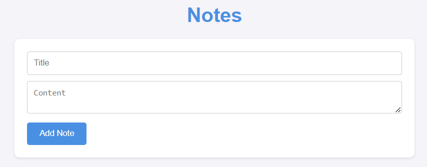

# Note Taking App

Um aplicativo simples para criar, editar e excluir notas, utilizando Flask e armazenamento em arquivo JSON.

## Interface

<div align="center">
  
</div>

## Sumário

- [Tecnologias Utilizadas](#tecnologias-utilizadas)
- [Status](#status)
- [Descrição](#descrição)
- [Funcionalidades](#funcionalidades)
- [Explicação](#explicação)
- [Como Usar](#como-usar)
- [Autor](#autor)

## Tecnologias Utilizadas

<div style="display: flex; flex-direction: row;">
  <div style="margin-right: 20px; display: flex; justify-content: flex-start;">
    
  </div>
  <div style="margin-right: 20px; display: flex; justify-content: flex-start;">
    
  </div>
  
</div>

## Status


## Descrição

Este projeto é um aplicativo de notas que permite criar, editar e excluir notas. As notas são armazenadas em um arquivo JSON local.

## Funcionalidades

- Criação de notas
- Edição de notas
- Exclusão de notas
- Armazenamento de notas em arquivo JSON

## Explicação

O projeto utiliza Flask para criar um servidor web simples que gerencia notas. As notas são carregadas de um arquivo JSON e salvas novamente sempre que uma nota é adicionada, editada ou excluída.

## Como Usar

1. Clone o repositório:
   ```sh
   git clone https://github.com/dgusfr/webPythonFlask.git
   ```
2. Navegue até o diretório do projeto:
   ```sh
   cd webpythonflask
   ```
3. Crie um ambiente virtual e ative-o:
   ```sh
   python -m venv venv
   source venv/bin/activate  # No Windows, use `venv\Scripts\activate`
   ```
4. Instale as dependências:
   ```sh
   pip install Flask
   ```
5. Inicie o servidor:
   ```sh
   flask run
   ```
6. Abra o navegador e acesse `http://127.0.0.1:5000/` para ver o aplicativo em funcionamento.

## Autor

Desenvolvido por Diego Franco
